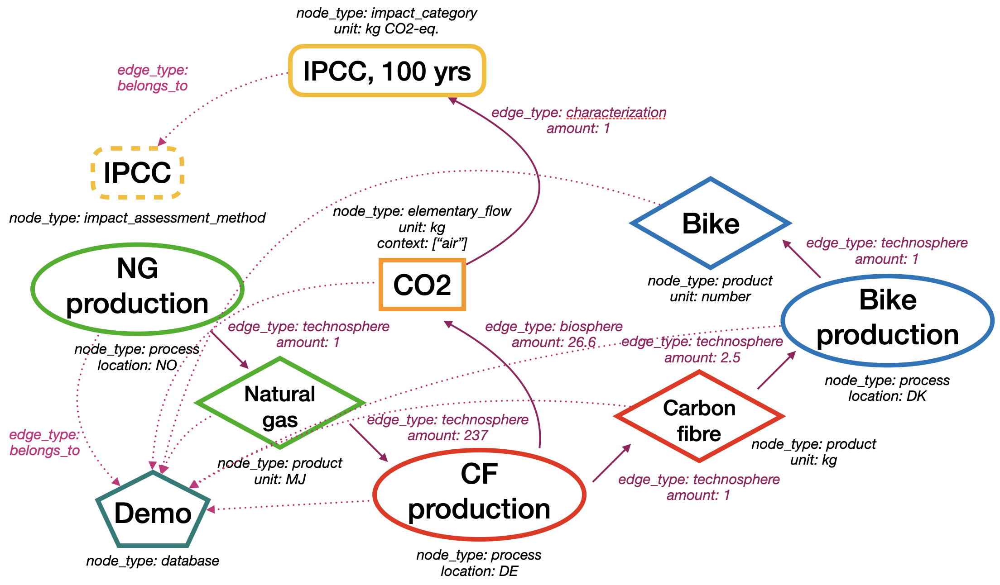

# bw_interface_schemas

[][pypi status]
[][pypi status]
[][pypi status]
[][license]

## About

`bw_interface_schemas` defines a set of [pydantic](https://docs.pydantic.dev/2.0/) classes which will be the fundamental data schema for the next iteration of the Brightway LCA software ecosystem. These schemas provide clear and consistent graph-based interfaces between Brightway software libraries, and simplify and harmonize the way data was modeled and stored in Brightway.

We have chosen to model all data in a directed graph, i.e. as nodes and (directed) edges. This includes inventory data, which models how processes consume and produce products to form supply chains, but also includes impact assessment, where elementary flows are linked to impact categories via characterization edges, and collections, where processes and products belong to databases.

## Example

Here is our standard bicycle production example in the new paradigm:



You can see this graph in code in `tests/conftest.py`.

## Motivation

In previous Brightway versions, the libraries were tightly coupled, and the schemas for passing data between Python libraries or with other software were never explicitly defined or custom-developed. This led to a chaos of utility conversion functions without any guarantees on broad format or on the availability of specific attributes.

The approach in `bw_interface_schemas` allows for a more modular approach, where Brightway IO libraries can work with multiple data stores or data generation and manipulation packages. The definition of nodes and edges is clear, and using `pydantic` gives us reasonable error messages and validation performance.

We have also fixed some poor design choices in older Brightway versions. For example, previously edges were defined on nodes: `node['exchanges'] = list`. In this schema, the `node` was *always* the edge `target`, even if that didn't make any sense. So emissions were inputs, goods being produced were inputs, etc. Edges also had to be quantitative, so dummy values were added to make proxies for qualitative edges.

Another poor design choice was storing some aspects of the graph outside of the graph. Things like project, databases, impact categories, and other LCIA objects, were stored in a different format (JSON or pickle) in a separate place (filesystem instead of relational database). We now unify these concepts and their data schemas in single graph.

## Design decisions

* All data is in a graph. That means that the only way we have to express data is nodes linked with edges. A single graph can provide all the information in a project.
* All attribute data is stored as JSON-serializable values.
* Nodes have identifiers. We stores nodes as a dictionary, where the identifiers are the keys. Edge `source` and `target` attributes refer to these identifiers. Identifiers can be strings or integers, and their label in the node datasets themselves is flexible.
* Nodes and edges have types, and type labels are given in a set of `Enum` classes. These types correspond with pydantic classes which include custom data attributes and validation functions.
* Edges have direction, and their direction is meaningful. For example, a process producing a product would have an edge from (`source`) the process to (`target`) a product. If the product was consumed as an input of the process, the product would be the `source` and the process would be the `target`. The same logic applies to processes and elementary flows.
* The part of the graph which will be used to construct the technosphere matrix (i.e. the supply and consumption of goods in supply chains) has a strict product -> process -> product pattern. Edges between processes and products must state whether or not they are functional. A functional edge is one where the modeller has indicated that the product being consumed or produced is one of the functions of the process.
* Processes are located in time and space. Products can be generic (their attributes apply regardless of where or when the product is produced or consumed, such as products meeting some standard), or can have spatio-temporal specificity (the sulfur content or energetic density of natural gas varies across time and space).
* Elementary flows and products can refer to the same underlying concepts, but are distinct nodes. For example, carbon dioxide has industrial uses and is also an important air resource and emission, but because it operates in different contexts in all three cases, each of these cases is modeled as a different class instance. Biosphere edges always link process nodes to elementary flow nodes, and elementary flows nodes can only appear in the biosphere and LCIA matrices - therefore elementary flow nodes cannot be present in the technosphere matrix.
* There is no rigid normalization pattern. Edges allow for some degree of normalization (edge source and targets act like foreign keys to nodes), but other attributes like units are not normalized. Our intent is to specify some of these non-normalized attributes in the [Sentier.dev](https://vocab.sentier.dev/en-US/) vocabulary, and to develop practical approaches to other tricky attributes like location.

## Tags, properties, or dataset attributes?

* Tags are for choosing from an already known set of possibilities where more than one node could share the same value.
* Properties are for numeric values which describe the object's attributes or performance.
* Dataset attributes (i.e. `node['foo']`) are for everything else.

As always, [hard cases make bad law](https://en.wikipedia.org/wiki/Hard_cases_make_bad_law), and some things could fit into multiple possible buckets. We will expand and clarify this distinction with more experience.

## Comparison with Brightway2

These new interfaces **break backwards compatibility**. We do not take such steps lightly; these changes were necessary to include product systems, projects, and methods in the same data store as other nodes and edges, and to add sanity checks and simpler code paths to building correct supply chain models.

Our approach has the following advantages:

* Edge `source` and `target` attributes now correctly indicate direction. Previously production edges had the product being produced as an input. Similarly, elementary flows being emitted were still modeled as inputs.
* Removal of implicit production edges. These seemed like a convenience but ultimately led to many hacks and difficult to diagnose incorrect behaviour for users.
* Removal of edge `type` labels which were at best confusing and sometimes incorrect. Edges now have a small set of possible types which only indicates the matrix they can be used in, and explicit instead of implicit direction.
* Clear separation of processes and products. Processes can only consume and produce products, and vice-versa. The previous allowance of chimaera processes which acted as products made modelling of multifunctional processes difficult and error-prone.
* The single graph format with LCI and LCIA nodes can sensibly model impact assessment data. Previously impact assessment data had to pretend to be inventory databases in `bw2io`.
* A unified data format which is identical in Python and JSON. This makes serialization, data storage, and exchange across systems and languages much easier.
* Pydantic validation provides usable feedback and prevents data errors entering the database.

## Installation

You can install _bw_interface_schemas_ via [pip] from [PyPI]:

```console
$ pip install bw_interface_schemas
```

## Contributing

Contributions are very welcome.
To learn more, see the [Contributor Guide][Contributor Guide].

## License

Distributed under the terms of the [MIT license][License],
_bw_interface_schemas_ is free and open source software.

## Issues

If you encounter any problems,
please [file an issue][Issue Tracker] along with a detailed description.


<!-- github-only -->

[command-line reference]: https://bw_interface_schemas.readthedocs.io/en/latest/usage.html
[License]: https://github.com/brightway-lca/bw_interface_schemas/blob/main/LICENSE
[Contributor Guide]: https://github.com/brightway-lca/bw_interface_schemas/blob/main/CONTRIBUTING.md
[Issue Tracker]: https://github.com/brightway-lca/bw_interface_schemas/issues
